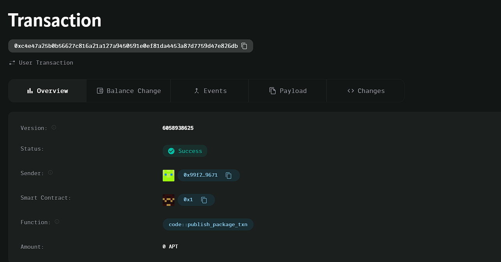

### Deployed smartcontract address: 0xc4e47a25b0b56627c816a21a127a9450591e0ef81da4453a87d7759d47e826db

### Screenshot:

# Decentralized ToDo List

## Project Description
The Decentralized ToDo List is a blockchain-based application designed to store and manage personal tasks. By leveraging the blockchain, tasks are transparent, immutable, and verifiable, ensuring that users can keep track of their to-do lists in a decentralized manner. This Move smart contract allows users to create tasks and mark them as completed while storing the data on the Aptos blockchain.

## Vision
The vision of the Decentralized ToDo List is to provide users with a transparent, decentralized platform to manage their personal tasks. It aims to enhance user privacy, ensure data integrity, and enable users to manage their tasks without relying on centralized services.

## Key Features
- **Create Tasks:** Users can create tasks with a description, which are stored on the blockchain.
- **Mark Task as Completed:** Users can mark tasks as completed, updating their status on the blockchain.
- **Immutability:** Once a task is created, its description cannot be altered, ensuring transparency.
- **Blockchain Transparency:** All tasks are stored on the blockchain, ensuring data integrity.

## Smart Contract Overview
- `create_task(account: &signer, description: vector<u8>)`: Allows users to create a task with a specific description.
- `mark_task_completed(account: &signer)`: Marks a task as completed.

## Future Scope
- **Task Deletion:** Adding functionality to delete tasks from the list.
- **Task Filtering:** Enable users to filter tasks based on their status (completed or not).
- **Multiple Tasks Management:** Allow users to create, manage, and complete multiple tasks at once.
- **Task Due Date:** Add the ability to set due dates for tasks.
- **Collaboration Features:** Allow multiple users to collaborate on the same to-do list.
